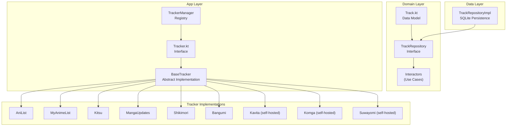

# Mihon Tracking Feature Research

## 1. Mihon's Tracking Architecture

Mihon follows a **clean architecture** pattern with clear separation of concerns:

```
Domain Layer
├── Track.kt (Data Model)
├── TrackRepository (Interface)
└── Interactors (Use Cases)

Data Layer
└── TrackRepositoryImpl (SQLite Persistence)

App Layer
├── Tracker.kt (Interface)
├── BaseTracker (Abstract Implementation)
└── TrackerManager (Registry)

Tracker Implementations
├── AniList
├── MyAnimeList
├── Kitsu
├── MangaUpdates
├── Shikimori
├── Bangumi
├── Kavita (self-hosted)
├── Komga (self-hosted)
└── Suwayomi (self-hosted)
```

## 2. Supported Trackers

| Tracker | Type | Notes |
|---------|------|-------|
| **MyAnimeList** | Public | OAuth2, most popular |
| **AniList** | Public | OAuth2, GraphQL API |
| **Kitsu** | Public | OAuth2, JSON API |
| **MangaUpdates** | Public | For manga specifically |
| **Shikimori** | Public | Russian tracker |
| **Bangumi** | Public | Chinese tracker |
| **Kavita** | Self-hosted | Manga server integration |
| **Komga** | Self-hosted | Manga server integration |
| **Suwayomi** | Self-hosted | Tachiyomi server |

## 3. Track Data Model (Mihon)

```kotlin
data class Track(
    val id: Long,              // Local database ID
    val mangaId: Long,         // Link to local manga
    val trackerId: Long,       // Which tracker (e.g., AniList=2)
    val remoteId: Long,        // ID on the tracker service
    val libraryId: Long?,      // Tracker's library entry ID
    val title: String,         // Title on tracker
    val lastChapterRead: Double, // Progress (supports decimals)
    val totalChapters: Long,   // Total chapters from tracker
    val status: Long,          // Reading status
    val score: Double,         // User's score
    val remoteUrl: String,     // URL to tracker page
    val startDate: Long,       // Start date (epoch millis)
    val finishDate: Long,      // Finish date (epoch millis)
    val private: Boolean,      // Private entry flag
)
```

## 4. Tracker Interface Methods

### Core Properties
- `supportsReadingDates: Boolean` - Whether tracker supports start/finish dates
- `supportsPrivateTracking: Boolean` - Whether tracker supports private entries

### Status Management
- `getStatusList(): List<Long>` - All available statuses
- `getStatus(status: Long): StringResource?` - Localized status name
- `getReadingStatus(): Long` - "Reading" status constant
- `getRereadingStatus(): Long` - "Re-reading" status constant
- `getCompletionStatus(): Long` - "Completed" status constant

### Score Management
- `getScoreList(): ImmutableList<String>` - Available score options
- `get10PointScore(track): Double` - Normalize to 10-point scale
- `indexToScore(index: Int): Double` - Convert UI index to score
- `displayScore(track): String` - Format score for display

### Core Operations
- `update(track, didReadChapter): Track` - Update progress on tracker
- `bind(track, hasReadChapters): Track` - Link manga to tracker entry
- `search(query): List<TrackSearch>` - Search for manga on tracker
- `refresh(track): Track` - Sync data from tracker

### Authentication
- `login(username, password)` - Authenticate with tracker
- `logout()` - Clear credentials
- `isLoggedIn: Boolean` - Current auth state
- `isLoggedInFlow: Flow<Boolean>` - Reactive auth state

### Remote Operations
- `setRemoteStatus(track, status)` - Update status
- `setRemoteLastChapterRead(track, chapterNumber)` - Update progress
- `setRemoteScore(track, scoreString)` - Update score
- `setRemoteStartDate(track, epochMillis)` - Set start date
- `setRemoteFinishDate(track, epochMillis)` - Set finish date
- `setRemotePrivate(track, private)` - Set private flag

## 5. AniList Implementation Details

### Status Constants
```kotlin
READING = 1L
COMPLETED = 2L
ON_HOLD = 3L
DROPPED = 4L
PLAN_TO_READ = 5L
REREADING = 6L
```

### Score Types Supported
- `POINT_100` - 0-100 scale
- `POINT_10` - 0-10 scale
- `POINT_10_DECIMAL` - 0.0-10.0 decimal
- `POINT_5` - 0-5 stars (★)
- `POINT_3` - Smiley faces (😦😐😊)

### Key Features
- **Auto-status updates**: Automatically sets COMPLETED when last chapter is read
- **Date tracking**: Sets start date on first chapter, finish date on completion
- **Re-reading support**: Dedicated REREADING status
- **Private tracking**: Can mark entries as private
- **Score preference sync**: Fetches user's preferred score type from AniList

## 6. Comparison: Mihon vs PyYomi

| Feature | Mihon | PyYomi | Gap |
|---------|-------|--------|-----|
| **Trackers** | 9 trackers | 2 trackers (AniList, MAL) | Missing 7 |
| **Status Management** | ✅ Full (6 statuses) | ❌ None | **Critical** |
| **Score/Rating** | ✅ Full (multiple formats) | ❌ None | **High** |
| **Start/Finish Dates** | ✅ Yes | ❌ None | **Medium** |
| **Re-reading Status** | ✅ Yes | ❌ None | **Medium** |
| **Private Tracking** | ✅ Yes | ❌ None | **Low** |
| **Total Chapters** | ✅ Synced from tracker | ❌ None | **Medium** |
| **Chapter Progress** | ✅ Double (decimals) | ✅ Integer | Minor |
| **Search** | ✅ Yes | ✅ Yes | ✅ |
| **OAuth** | ✅ Yes | ✅ Yes | ✅ |
| **Per-manga Mapping** | ✅ Yes | ✅ Yes | ✅ |
| **Link/Unlink** | ✅ Yes | ✅ Yes | ✅ |
| **Refresh/Sync** | ✅ Yes | ❌ Limited | **High** |
| **Delete from Tracker** | ✅ Yes (DeletableTracker) | ❌ None | **Medium** |
| **Tracker Icons** | ✅ Yes | ❌ None | **Low** |

## 7. PyYomi Current Implementation

### Data Model (TrackerMapping)
```python
class TrackerMapping(SQLModel, table=True):
    manga_id: int
    tracker_name: str
    tracker_manga_id: str
    tracker_url: Optional[str]
    last_synced_chapter: Optional[int]
    last_synced_at: Optional[datetime]
    sync_status: str  # 'pending', 'synced', 'error'
```

### BaseTracker Interface
```python
class BaseTracker(ABC):
    async def search_manga(access_token, query) -> List[TrackerManga]
    async def update_progress(access_token, manga_id, chapters_read) -> bool
    async def get_user_list(access_token) -> List[TrackerManga]
```

### TrackerManga Data Class
```python
@dataclass
class TrackerManga:
    id: str
    title: str
    chapters: Optional[int]
    status: str
    user_status: Optional[str]  # Added
    user_chapters: Optional[int]  # Added
```

## 8. Recommendations for PyYomi

### Priority 1: Critical (Core Tracking Features)

1. **Add Status Management**
   - Add `status` field to `TrackerMapping` model
   - Implement status constants per tracker
   - Add `set_status()` method to `BaseTracker`
   - Add UI for status selection (Reading, Completed, On Hold, Dropped, Plan to Read)

2. **Add Score/Rating System**
   - Add `score` field to `TrackerMapping` model
   - Implement `get_score_list()` per tracker
   - Add `set_score()` method to `BaseTracker`
   - Add UI for score selection

3. **Enhance update_progress()**
   - Auto-update status to COMPLETED when last chapter read
   - Support for updating status, score, dates in one call

### Priority 2: High (Enhanced Sync)

4. **Add Date Tracking**
   - Add `start_date` and `finish_date` fields to `TrackerMapping`
   - Implement `set_start_date()` and `set_finish_date()` methods
   - Auto-set dates when reading first/last chapter

5. **Implement Refresh/Sync**
   - Add `refresh()` method to pull latest data from tracker
   - Sync total chapters from tracker
   - Handle conflicts between local and remote data

6. **Add Delete Functionality**
   - Add `delete_entry()` method to remove from tracker
   - Add UI option to "Remove from tracker"

### Priority 3: Medium (Additional Trackers)

7. **Add More Trackers**
   - **Kitsu**: Popular anime/manga tracker with good API
   - **MangaUpdates**: Specialized for manga
   - **Shikimori**: Good for Russian user base

8. **Add Self-hosted Support**
   - **Kavita**: Popular self-hosted manga server
   - **Komga**: Another popular self-hosted option

### Priority 4: Low (Polish)

9. **Add Re-reading Support**
   - Add `is_rereading` boolean field
   - Add re-reading status handling

10. **Add Private Tracking**
    - Add `is_private` boolean field
    - Implement for trackers that support it

11. **UI Enhancements**
    - Add tracker logos/icons
    - Show sync status indicators
    - Add batch sync options

## 9. Suggested Data Model Updates

```python
class TrackerMapping(SQLModel, table=True):
    """Enhanced mapping with full tracking support"""
    id: Optional[int] = Field(default=None, primary_key=True)
    manga_id: int = Field(foreign_key="manga.id", index=True)
    tracker_name: str = Field(index=True)
    tracker_manga_id: str
    tracker_url: Optional[str] = None
    
    # Progress
    last_synced_chapter: Optional[int] = None
    total_chapters: Optional[int] = None  # From tracker
    
    # Status
    status: str = "plan_to_read"  # reading, completed, on_hold, dropped, plan_to_read, rereading
    
    # Score (stored as 10-point scale internally)
    score: Optional[float] = None  # 0.0 - 10.0
    
    # Dates (ISO 8601 or epoch millis)
    start_date: Optional[datetime] = None
    finish_date: Optional[datetime] = None
    
    # Privacy
    is_private: bool = False
    
    # Sync metadata
    last_synced_at: Optional[datetime] = None
    sync_status: str = "pending"
    created_at: datetime = Field(default_factory=datetime.utcnow)
    updated_at: datetime = Field(default_factory=datetime.utcnow)
```

## 10. Suggested BaseTracker Updates

```python
class BaseTracker(ABC):
    # Properties
    @property
    def supports_reading_dates(self) -> bool: return False
    
    @property
    def supports_private_tracking(self) -> bool: return False
    
    # Status methods
    @abstractmethod
    def get_status_list(self) -> List[str]:
        """Return list of available statuses"""
        pass
    
    @abstractmethod
    async def set_status(self, access_token: str, manga_id: str, status: str) -> bool:
        """Set reading status on tracker"""
        pass
    
    # Score methods
    @abstractmethod
    def get_score_list(self) -> List[str]:
        """Return list of available scores for UI"""
        pass
    
    @abstractmethod
    async def set_score(self, access_token: str, manga_id: str, score: float) -> bool:
        """Set score on tracker"""
        pass
    
    # Date methods
    async def set_start_date(self, access_token: str, manga_id: str, date: datetime) -> bool:
        """Set start date (if supported)"""
        pass
    
    async def set_finish_date(self, access_token: str, manga_id: str, date: datetime) -> bool:
        """Set finish date (if supported)"""
        pass
    
    # Enhanced update
    async def update_entry(self, access_token: str, manga_id: str, 
                          chapters_read: Optional[int] = None,
                          status: Optional[str] = None,
                          score: Optional[float] = None,
                          start_date: Optional[datetime] = None,
                          finish_date: Optional[datetime] = None) -> bool:
        """Update all fields in one call"""
        pass
    
    # Delete
    async def delete_entry(self, access_token: str, manga_id: str) -> bool:
        """Remove from tracker list"""
        pass
    
    # Refresh
    @abstractmethod
    async def get_entry(self, access_token: str, manga_id: str) -> Optional[TrackerManga]:
        """Get current entry data from tracker"""
        pass
```

## Summary

Mihon's tracking implementation is significantly more comprehensive than PyYomi's current implementation. The key gaps are:

1. **Status management** - Mihon supports 6 statuses, PyYomi has none
2. **Score/rating** - Mihon supports multiple score formats, PyYomi has none
3. **Date tracking** - Mihon tracks start/finish dates, PyYomi has none
4. **Additional trackers** - Mihon supports 9 trackers, PyYomi has 2
5. **Enhanced sync** - Mihon can pull remote data, PyYomi is push-only

The recommended approach is to prioritize status and score management first, as these are core tracking features that users expect. Date tracking and additional trackers can follow. The architecture should be updated to support tracker-specific capabilities (like `supports_reading_dates`, `supports_private_tracking`) to handle differences between trackers gracefully.


Mihon follows a clean architecture pattern with clear separation of concerns:
