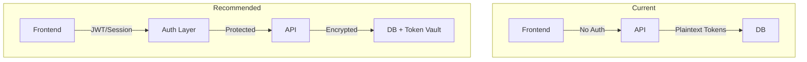

# Security Audit Report: Feature/tracking and data management

> **Audit Date**: 2026-02-26  
> **Branch**: Feature/tracking and data management  
> **Auditor**: Security Review

---

## Executive Summary

This security audit identified **12 security issues** in the tracking and data management feature, ranging from **Critical** to **Low** severity. The most critical issues are the complete absence of authentication/authorization and the use of deprecated OAuth implicit grant flow.

---

## Critical Issues

### 1. No Authentication/Authorization on API Endpoints

**Severity**: CRITICAL  
**Location**: [`backend/app/main.py`](backend/app/main.py)

The entire API has no authentication or authorization mechanism. All endpoints are publicly accessible without any user verification.

**Code Reference**:
```python
# No authentication dependencies in any router
app.include_router(trackers_router, prefix="/api/v1", tags=["trackers"])
```

**Impact**: 
- Anyone can access all API endpoints
- Anyone can connect/disconnect trackers for any user
- Reading history, library, and user data is fully exposed

**Recommendation**: Implement a session-based or token-based authentication system:
1. Add FastAPI dependency for authentication
2. Create user model with secure password hashing
3. Add login/logout endpoints
4. Protect all sensitive endpoints with authentication requirements

---

### 2. OAuth Implicit Grant Flow (Deprecated)

**Severity**: CRITICAL  
**Locations**: 
- [`backend/app/trackers/anilist.py`](backend/app/trackers/anilist.py:113-118)
- [`frontend/src/app/tracker/callback/page.tsx`](frontend/src/app/tracker/callback/page.tsx:32-52)
- [`backend/app/api/trackers.py`](backend/app/api/trackers.py:437-477)

The application uses OAuth implicit grant flow which is deprecated and insecure.

**Code Reference** (anilist.py):
```python
if self.uses_implicit_grant:
    params = {
        "client_id": config.client_id,
        "response_type": "token",  # Implicit grant - insecure!
    }
```

**Issues**:
1. Access tokens are exposed in URL fragments
2. Tokens can be logged in browser history
3. Tokens can be leaked via referrer headers
4. No refresh tokens (tokens last ~1 year)
5. Vulnerable to CSRF attacks

**Recommendation**: Migrate to PKCE (Proof Key for Code Exchange) flow:
1. Use `response_type=code` instead of `token`
2. Generate `code_verifier` and `code_challenge`
3. Store `code_verifier` server-side
4. Exchange code for tokens in backend

---

## High Severity Issues

### 3. In-Memory OAuth State Storage

**Severity**: HIGH  
**Location**: [`backend/app/api/trackers.py`](backend/app/api/trackers.py:25)

```python
oauth_states: dict = {}  # Lost on server restart
```

**Issues**:
1. OAuth states are lost on server restart (multi-worker deployments)
2. No expiration on OAuth states (state fixation possible)
3. Doesn't scale beyond single worker

**Recommendation**: 
1. Use Redis or database for state storage
2. Add state expiration (10-15 minutes)
3. Implement proper state cleanup

---

### 4. Encryption Key Stored in Plain Text File

**Severity**: HIGH  
**Location**: [`backend/app/services/encryption.py`](backend/app/services/encryption.py:15-27)

```python
def _load_or_create_local_key(self) -> str:
    key_file = self._file_path()
    # Key stored in plain text file
    with open(key_file, "w") as f:
        f.write(key)
```

**Issues**:
1. Encryption key stored in plain text file on disk
2. File `.encryption_key` may be committed to version control
3. Anyone with file access can decrypt all tokens

**Recommendation**:
1. Require `ENCRYPTION_KEY` environment variable
2. Remove auto-generation in production
3. Add file permissions check
4. Add warning if key file has insecure permissions

---

### 5. STATE_SECRET Has Insecure Default

**Severity**: HIGH  
**Location**: [`backend/app/api/trackers.py`](backend/app/api/trackers.py:28)

```python
STATE_SECRET = os.environ.get("STATE_SECRET", secrets.token_hex(32))
```

**Issues**:
1. Default secret is randomly generated at startup
2. All OAuth states become invalid on server restart
3. In multi-instance deployments, states from one instance won't work on another

**Recommendation**:
1. Make `STATE_SECRET` required (no default)
2. Document that it must be set in production
3. Validate secret meets minimum complexity requirements

---

### 6. No Rate Limiting

**Severity**: HIGH  
**Location**: All API endpoints

No rate limiting on any endpoint. Vulnerable to:
- Brute force attacks
- API abuse
- DoS attacks

**Recommendation**: Implement rate limiting:
1. Use slowapi or fastapi-limiter
2. Add per-IP limits
3. Add per-user limits for authenticated endpoints

---

## Medium Severity Issues

### 7. Permissive CORS Configuration

**Severity**: MEDIUM  
**Location**: [`backend/app/main.py`](backend/app/main.py:112-126)

```python
allowed = os.getenv(
    "ALLOWED_ORIGINS",
    "http://localhost:3000,http://127.0.0.1:3000,..."  # Many origins
).split(",")
```

**Issues**:
1. Default allows multiple localhost variants
2. `allow_credentials=True` with wildcard-like config
3. No origin validation beyond the list

**Recommendation**:
1. Strict CORS in production
2. Use exact origin matching
3. Consider using a proxy instead of CORS

---

### 8. Token Not Validated After Implicit Grant

**Severity**: MEDIUM  
**Location**: [`backend/app/api/trackers.py`](backend/app/api/trackers.py:460-477)

```python
async def implicit_grant_callback(...):
    # Token is used directly without validation
    user_info = await tracker.get_user_info(request.access_token)
```

**Issues**:
1. No validation that the token was issued for this application
2. Token could be replayed from another OAuth flow
3. No token type validation

**Recommendation**:
1. Validate token audience/issuer
2. Check token type
3. Implement token binding

---

### 9. No Input Validation on Query Parameters

**Severity**: MEDIUM  
**Location**: Multiple API endpoints

Query parameters like `manga_id`, `chapter_number` are used without validation.

**Recommendation**:
1. Add Pydantic models with validation
2. Add range checks on numeric parameters
3. Sanitize string inputs

---

### 10. Silent Exception Handling in Background Sync

**Severity**: MEDIUM  
**Location**: [`backend/app/api/updates.py`](backend/app/api/updates.py:64-69)

```python
except Exception:
    pass  # Errors are silently swallowed
```

**Issues**:
1. Sync failures are not logged properly
2. No user notification of failures
3. Makes debugging difficult

**Recommendation**:
1. Log all exceptions
2. Add proper error reporting
3. Track failures in database

---

## Low Severity Issues

### 11. Hardcoded Client ID in Source Code

**Severity**: LOW  
**Location**: [`backend/app/trackers/anilist.py`](backend/app/trackers/anilist.py:19)

```python
DEFAULT_CLIENT_ID = "36426"
```

**Issues**:
1. Exposes a shared client ID
2. May be rate-limited or revoked
3. Cannot rotate without code changes

**Recommendation**: 
1. Remove default client IDs
2. Require all clients to register their own
3. Document registration process

---

### 12. No CSRF Protection on State Parameter

**Severity**: LOW  
**Location**: [`backend/app/api/trackers.py`](backend/app/api/trackers.py:90-111)

While state is validated, there's no explicit CSRF token mechanism for API calls.

**Recommendation**: 
1. Implement proper CSRF tokens
2. Use SameSite cookies
3. Add CSRF middleware

---

## Security Architecture Recommendations



### Recommended Security Stack

1. **Authentication**: FastAPI-Users or custom JWT implementation
2. **Authorization**: Role-based access control (RBAC)
3. **OAuth**: PKCE flow only (no implicit)
4. **Token Storage**: HashiCorp Vault or encrypted database
5. **Rate Limiting**: slowapi
6. **Input Validation**: Pydantic models
7. **Secret Management**: Environment variables required, no defaults

---

## Summary Table

| Issue | Severity | Status |
|-------|----------|--------|
| No Authentication/Authorization | CRITICAL | Needs Fix |
| OAuth Implicit Grant Flow | CRITICAL | Needs Fix |
| In-Memory OAuth State | HIGH | Needs Fix |
| Encryption Key in File | HIGH | Needs Fix |
| Insecure STATE_SECRET | HIGH | Needs Fix |
| No Rate Limiting | HIGH | Needs Fix |
| Permissive CORS | MEDIUM | Needs Fix |
| Token Not Validated | MEDIUM | Needs Fix |
| No Input Validation | MEDIUM | Needs Fix |
| Silent Exception Handling | MEDIUM | Needs Fix |
| Hardcoded Client ID | LOW | Nice to Fix |
| No CSRF Protection | LOW | Nice to Fix |

---

## Conclusion

The current implementation has significant security vulnerabilities, particularly around authentication and OAuth. The CRITICAL and HIGH severity issues must be addressed before production deployment. The application should not be exposed to the public internet in its current state.
