# Tracking Integrations & Data Management Architecture

> **Document Version**: 1.0  
> **Last Updated**: 2026-02-24  
> **Author**: Architecture Team

## Table of Contents

1. [Overview](#1-overview)
2. [Database Schema Changes](#2-database-schema-changes)
3. [IndexedDB Schema with Dexie.js](#3-indexeddb-schema-with-dexiejs)
4. [Backend API Design](#4-backend-api-design)
5. [Frontend Architecture](#5-frontend-architecture)
6. [OAuth Flow Diagrams](#6-oauth-flow-diagrams)
7. [Sync Strategy](#7-sync-strategy)
8. [Security Considerations](#8-security-considerations)
9. [File Structure](#9-file-structure)
10. [Implementation Phases](#10-implementation-phases)

---

## 1. Overview

### 1.1 Goals

This document describes the architecture for two major features:

1. **Third-Party Tracking & Sync**: OAuth integration with MyAnimeList, AniList, Kitsu, and MangaUpdates with two-way sync capability
2. **Data Management & Portability**: IndexedDB storage for offline-first capability with export/import functionality

### 1.2 Current Architecture Context

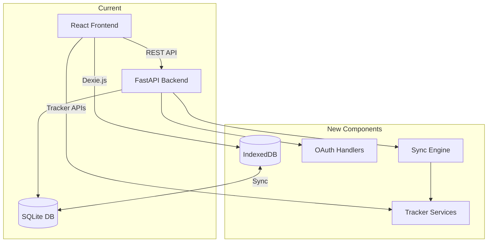

### 1.3 Design Principles

- **Offline-First**: IndexedDB as primary client storage with backend sync
- **Security**: Encrypted credential storage, PKCE for OAuth
- **Extensibility**: Plugin architecture for adding new trackers
- **User Control**: Manual sync triggers, conflict resolution preferences

---

## 2. Database Schema Changes

### 2.1 New SQLModel Tables

#### 2.1.1 TrackerCredential

Stores OAuth tokens for each linked tracker.

```python
class TrackerCredential(SQLModel, table=True):
    """Stores encrypted OAuth credentials for a tracker."""
    id: Optional[int] = Field(default=None, primary_key=True)
    tracker_type: str = Field(index=True)  # 'mal', 'anilist', 'kitsu', 'mangaupdates'
    user_id: Optional[str] = Field(default=None, index=True)  # Tracker user ID
    
    # Encrypted tokens
    access_token_encrypted: str  # AES-256 encrypted
    refresh_token_encrypted: Optional[str] = None
    token_expires_at: Optional[datetime] = None
    
    # Tracker metadata
    username: Optional[str] = None
    profile_url: Optional[str] = None
    
    # Status
    is_active: bool = Field(default=True)
    last_sync_at: Optional[datetime] = None
    sync_error: Optional[str] = None
    
    created_at: datetime = Field(default_factory=datetime.utcnow)
    updated_at: datetime = Field(default_factory=datetime.utcnow)
```

#### 2.1.2 TrackerMapping

Maps local manga to tracker entries.

```python
class TrackerMapping(SQLModel, table=True):
    """Maps local manga to tracker-specific entries."""
    id: Optional[int] = Field(default=None, primary_key=True)
    manga_id: int = Field(foreign_key="manga.id", index=True)
    tracker_type: str = Field(index=True)
    
    # Tracker entry identifiers
    tracker_manga_id: str  # ID on the tracker platform
    tracker_url: Optional[str] = None
    
    # Sync state
    last_synced_chapter: int = 0
    last_synced_at: Optional[datetime] = None
    sync_status: str = Field(default="pending")  # 'pending', 'synced', 'error'
    
    # Conflict tracking
    local_chapter: Optional[int] = None
    tracker_chapter: Optional[int] = None
    conflict_resolved: bool = Field(default=True)
    
    created_at: datetime = Field(default_factory=datetime.utcnow)
    updated_at: datetime = Field(default_factory=datetime.utcnow)
    
    # Composite unique constraint
    __table_args__ = (
        UniqueConstraint('manga_id', 'tracker_type', name='uq_manga_tracker'),
    )
```

#### 2.1.3 SyncQueue

Queue for pending sync operations.

```python
class SyncQueue(SQLModel, table=True):
    """Queue for pending sync operations."""
    id: Optional[int] = Field(default=None, primary_key=True)
    manga_id: int = Field(foreign_key="manga.id", index=True)
    tracker_type: str = Field(index=True)
    
    operation: str  # 'update_progress', 'add_to_library', 'remove_from_library'
    payload: str  # JSON payload
    
    status: str = Field(default="pending")  # 'pending', 'processing', 'completed', 'failed'
    retry_count: int = Field(default=0)
    max_retries: int = Field(default=3)
    last_error: Optional[str] = None
    
    created_at: datetime = Field(default_factory=datetime.utcnow)
    processed_at: Optional[datetime] = None
```

#### 2.1.4 DataExport

Track export history.

```python
class DataExport(SQLModel, table=True):
    """Tracks data export operations."""
    id: Optional[int] = Field(default=None, primary_key=True)
    filename: str
    file_size: int
    checksum: str  # SHA-256
    
    included_data: str  # JSON array of included data types
    created_at: datetime = Field(default_factory=datetime.utcnow)
```

### 2.2 Entity Relationship Diagram

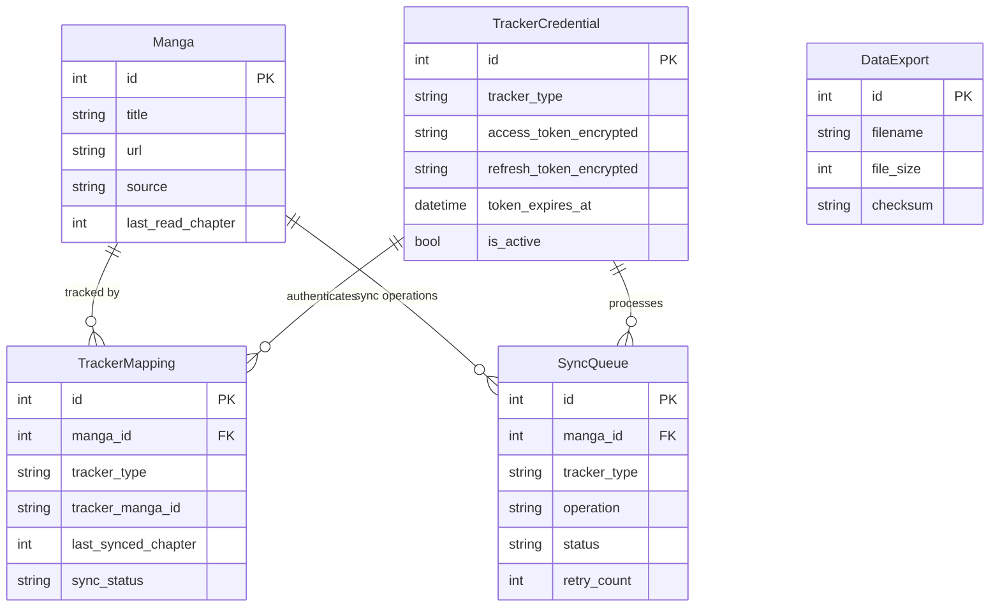

---

## 3. IndexedDB Schema with Dexie.js

### 3.1 Database Schema

```typescript
// frontend/src/lib/db/schema.ts
import Dexie, { Table } from 'dexie';

// Table interfaces
export interface LocalManga {
  id: number;
  title: string;
  url: string;
  thumbnailUrl?: string;
  source: string;
  description?: string;
  author?: string;
  artist?: string;
  genres?: string[];
  status?: string;
  lastReadChapter: number;
  lastReadAt?: Date;
  createdAt: Date;
  updatedAt: Date;
  isDeleted: boolean; // Soft delete for sync
  syncVersion: number; // For conflict detection
}

export interface LocalChapter {
  id: number;
  mangaId: number;
  chapterNumber: number;
  title?: string;
  url: string;
  isRead: boolean;
  isDownloaded: boolean;
  downloadedPath?: string;
  releaseDate?: Date;
  createdAt: Date;
  updatedAt: Date;
  isDeleted: boolean;
  syncVersion: number;
}

export interface LocalLibraryEntry {
  id: number;
  mangaId: number;
  addedAt: Date;
  categories: number[];
  isDeleted: boolean;
  syncVersion: number;
}

export interface LocalHistory {
  id: number;
  mangaId: number;
  chapterNumber: number;
  readAt: Date;
  isDeleted: boolean;
  syncVersion: number;
}

export interface LocalCategory {
  id: number;
  name: string;
  createdAt: Date;
  isDeleted: boolean;
  syncVersion: number;
}

export interface LocalReadingProgress {
  id: number;
  mangaId: number;
  chapterNumber: number;
  pageNumber: number;
  updatedAt: Date;
  syncVersion: number;
}

export interface ExtensionConfig {
  id: string; // Extension key
  name: string;
  enabled: boolean;
  settings: Record<string, unknown>;
  updatedAt: Date;
}

export interface SyncMetadata {
  id: string;
  lastSyncAt: Date;
  lastSyncChecksum: string;
  pendingChanges: number;
}

// Database class
export class PyYomiDB extends Dexie {
  manga!: Table<LocalManga, number>;
  chapters!: Table<LocalChapter, number>;
  library!: Table<LocalLibraryEntry, number>;
  history!: Table<LocalHistory, number>;
  categories!: Table<LocalCategory, number>;
  readingProgress!: Table<LocalReadingProgress, number>;
  extensionConfigs!: Table<ExtensionConfig, string>;
  syncMetadata!: Table<SyncMetadata, string>;

  constructor() {
    super('PyYomiDB');
    
    this.version(1).stores({
      manga: '++id, url, source, lastReadAt, updatedAt, isDeleted, syncVersion',
      chapters: '++id, mangaId, url, chapterNumber, isRead, isDownloaded, updatedAt, isDeleted',
      library: '++id, mangaId, addedAt, isDeleted',
      history: '++id, mangaId, chapterNumber, readAt, isDeleted',
      categories: '++id, name, isDeleted',
      readingProgress: '++id, mangaId, chapterNumber, updatedAt',
      extensionConfigs: 'id, enabled',
      syncMetadata: 'id',
    });
  }
}

export const db = new PyYomiDB();
```

### 3.2 IndexedDB Data Flow

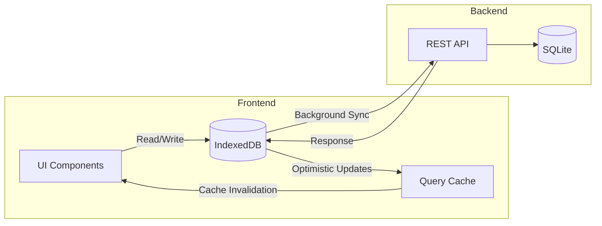

---

## 4. Backend API Design

### 4.1 OAuth Endpoints

#### 4.1.1 Tracker OAuth Router

```python
# backend/app/api/trackers.py

router = APIRouter(prefix="/trackers", tags=["trackers"])

# === OAuth Flow ===

@router.get("/{tracker_type}/auth/url")
async def get_oauth_url(
    tracker_type: str,
    redirect_uri: str,
    db: Session = Depends(get_session)
) -> dict:
    """
    Generate OAuth authorization URL for the specified tracker.
    
    Returns:
        - authorization_url: URL to redirect user to
        - state: CSRF protection token
        - code_verifier: PKCE code verifier (stored server-side)
    """
    pass

@router.post("/{tracker_type}/auth/callback")
async def oauth_callback(
    tracker_type: str,
    code: str,
    state: str,
    db: Session = Depends(get_session)
) -> dict:
    """
    Handle OAuth callback and exchange code for tokens.
    
    Returns:
        - success: bool
        - username: Tracker username
        - profile_url: User profile URL
    """
    pass

@router.delete("/{tracker_type}/auth")
async def unlink_tracker(
    tracker_type: str,
    db: Session = Depends(get_session)
) -> dict:
    """
    Revoke tokens and remove tracker credentials.
    """
    pass

# === Tracker Status ===

@router.get("")
async def list_trackers(
    db: Session = Depends(get_session)
) -> List[dict]:
    """
    List all available trackers with their connection status.
    
    Returns:
        List of tracker info:
        - type: Tracker identifier
        - name: Display name
        - is_linked: Whether user has linked account
        - username: Linked username (if linked)
        - last_sync_at: Last successful sync time
    """
    pass

@router.get("/{tracker_type}/status")
async def get_tracker_status(
    tracker_type: str,
    db: Session = Depends(get_session)
) -> dict:
    """
    Get detailed status for a specific tracker.
    """
    pass

# === Manga Search & Link ===

@router.get("/{tracker_type}/search")
async def search_tracker_manga(
    tracker_type: str,
    query: str,
    db: Session = Depends(get_session)
) -> List[dict]:
    """
    Search for manga on the tracker to create mappings.
    """
    pass

@router.post("/{tracker_type}/mappings")
async def create_mapping(
    tracker_type: str,
    manga_id: int,
    tracker_manga_id: str,
    db: Session = Depends(get_session)
) -> dict:
    """
    Create a mapping between local manga and tracker entry.
    """
    pass

@router.delete("/{tracker_type}/mappings/{manga_id}")
async def delete_mapping(
    tracker_type: str,
    manga_id: int,
    db: Session = Depends(get_session)
) -> dict:
    """
    Remove a tracker mapping.
    """
    pass
```

### 4.2 Sync Endpoints

```python
# backend/app/api/sync.py

router = APIRouter(prefix="/sync", tags=["sync"])

# === Manual Sync ===

@router.post("/trigger")
async def trigger_sync(
    tracker_types: Optional[List[str]] = None,
    db: Session = Depends(get_session)
) -> dict:
    """
    Manually trigger sync for specified trackers (or all if not specified).
    
    Returns:
        - sync_id: ID for tracking sync progress
        - status: 'started'
    """
    pass

@router.get("/status/{sync_id}")
async def get_sync_status(sync_id: str) -> dict:
    """
    Get status of a sync operation.
    
    Returns:
        - status: 'running', 'completed', 'failed'
        - progress: Percentage complete
        - items_synced: Number of items synced
        - errors: List of errors encountered
    """
    pass

# === Queue Management ===

@router.get("/queue")
async def get_sync_queue(
    status: Optional[str] = None,
    db: Session = Depends(get_session)
) -> List[dict]:
    """
    Get pending sync operations.
    """
    pass

@router.post("/queue/{queue_id}/retry")
async def retry_sync_item(queue_id: int) -> dict:
    """
    Retry a failed sync operation.
    """
    pass

@router.delete("/queue/{queue_id}")
async def cancel_sync_item(queue_id: int) -> dict:
    """
    Cancel a pending sync operation.
    """
    pass

# === Progress Update ===

@router.post("/progress")
async def update_progress(
    manga_id: int,
    chapter_number: int,
    tracker_types: Optional[List[str]] = None,
    db: Session = Depends(get_session)
) -> dict:
    """
    Update reading progress and queue tracker sync.
    Called when user finishes reading a chapter.
    """
    pass
```

### 4.3 Backup/Restore Endpoints

```python
# backend/app/api/backup.py

router = APIRouter(prefix="/backup", tags=["backup"])

@router.get("/export")
async def export_data(
    include: Optional[List[str]] = Query(default=[
        'library', 'history', 'categories', 'settings', 'tracker_mappings'
    ]),
    db: Session = Depends(get_session)
) -> StreamingResponse:
    """
    Export user data as JSON file.
    
    Query params:
        - include: List of data types to include
    
    Returns:
        StreamingResponse with JSON file attachment
    """
    pass

@router.post("/import")
async def import_data(
    file: UploadFile,
    conflict_strategy: str = Form(default='skip'),  # 'skip', 'overwrite', 'merge'
    db: Session = Depends(get_session)
) -> dict:
    """
    Import user data from JSON file.
    
    Form params:
        - file: JSON file to import
        - conflict_strategy: How to handle conflicts
    
    Returns:
        - imported: Counts of imported items by type
        - skipped: Counts of skipped items
        - errors: List of import errors
    """
    pass

@router.get("/preview")
async def preview_import(
    file: UploadFile,
    db: Session = Depends(get_session)
) -> dict:
    """
    Preview what would be imported without making changes.
    """
    pass

@router.get("/history")
async def get_export_history(
    db: Session = Depends(get_session)
) -> List[dict]:
    """
    Get history of data exports.
    """
    pass
```

### 4.4 API Endpoint Summary

| Endpoint | Method | Description |
|----------|--------|-------------|
| `/api/v1/trackers` | GET | List all trackers with status |
| `/api/v1/trackers/{type}/auth/url` | GET | Get OAuth authorization URL |
| `/api/v1/trackers/{type}/auth/callback` | POST | Handle OAuth callback |
| `/api/v1/trackers/{type}/auth` | DELETE | Unlink tracker |
| `/api/v1/trackers/{type}/search` | GET | Search manga on tracker |
| `/api/v1/trackers/{type}/mappings` | POST | Create manga mapping |
| `/api/v1/trackers/{type}/mappings/{manga_id}` | DELETE | Remove mapping |
| `/api/v1/sync/trigger` | POST | Trigger manual sync |
| `/api/v1/sync/status/{sync_id}` | GET | Get sync status |
| `/api/v1/sync/queue` | GET | Get sync queue |
| `/api/v1/sync/progress` | POST | Update progress and sync |
| `/api/v1/backup/export` | GET | Export data as JSON |
| `/api/v1/backup/import` | POST | Import data from JSON |
| `/api/v1/backup/preview` | GET | Preview import |

---

## 5. Frontend Architecture

### 5.1 Component Structure

```
frontend/src/
├── app/
│   └── settings/
│       └── trackers/           # New: Tracker settings page
│           └── page.tsx
├── components/
│   ├── trackers/               # New: Tracker components
│   │   ├── TrackerCard.tsx     # Individual tracker status card
│   │   ├── TrackerLinkDialog.tsx
│   │   ├── TrackerSearchDialog.tsx
│   │   └── MappingList.tsx
│   ├── backup/                 # New: Backup/restore components
│   │   ├── ExportDialog.tsx
│   │   ├── ImportDialog.tsx
│   │   └── ImportPreview.tsx
│   └── sync/                   # New: Sync components
│       ├── SyncStatusIndicator.tsx
│       └── SyncQueueList.tsx
├── hooks/
│   ├── useTrackers.ts          # New: Tracker state hook
│   ├── useSync.ts              # New: Sync operations hook
│   └── useOfflineDB.ts         # New: IndexedDB hook
├── lib/
│   ├── db/                     # New: IndexedDB setup
│   │   ├── schema.ts
│   │   ├── migrations.ts
│   │   └── sync.ts
│   └── api.ts                  # Extended with new endpoints
├── services/
│   ├── trackerService.ts       # New: Tracker API service
│   ├── syncService.ts          # New: Sync service
│   └── backupService.ts        # New: Backup service
└── types/
    └── tracker.ts              # New: Tracker type definitions
```

### 5.2 State Management

#### 5.2.1 React Query Integration

```typescript
// frontend/src/hooks/useTrackers.ts
import { useQuery, useMutation, useQueryClient } from '@tanstack/react-query';
import { trackerService } from '../services/trackerService';

export function useTrackers() {
  const queryClient = useQueryClient();
  
  const { data: trackers, isLoading } = useQuery({
    queryKey: ['trackers'],
    queryFn: trackerService.listTrackers,
    staleTime: 5 * 60 * 1000, // 5 minutes
  });
  
  const linkMutation = useMutation({
    mutationFn: ({ trackerType, code, state }: LinkParams) =>
      trackerService.handleCallback(trackerType, code, state),
    onSuccess: () => {
      queryClient.invalidateQueries({ queryKey: ['trackers'] });
    },
  });
  
  const unlinkMutation = useMutation({
    mutationFn: (trackerType: string) => trackerService.unlink(trackerType),
    onSuccess: () => {
      queryClient.invalidateQueries({ queryKey: ['trackers'] });
    },
  });
  
  return {
    trackers,
    isLoading,
    linkTracker: linkMutation.mutate,
    unlinkTracker: unlinkMutation.mutate,
    isLinking: linkMutation.isPending,
    isUnlinking: unlinkMutation.isPending,
  };
}
```

#### 5.2.2 IndexedDB Sync Hook

```typescript
// frontend/src/hooks/useOfflineDB.ts
import { useQueryClient } from '@tanstack/react-query';
import { db, LocalManga, LocalLibraryEntry } from '../lib/db/schema';
import { api } from '../lib/api';

export function useOfflineDB() {
  const queryClient = useQueryClient();
  
  // Sync local changes to backend
  const syncToBackend = async () => {
    const pendingManga = await db.manga
      .where('syncVersion')
      .above(0)
      .toArray();
    
    for (const manga of pendingManga) {
      if (manga.isDeleted) {
        await api.delete(`/library/${manga.id}`);
      } else {
        await api.put(`/library/${manga.id}`, manga);
      }
    }
    
    // Reset sync versions after successful sync
    await db.manga.where('id').anyOf(pendingManga.map(m => m.id)).modify({
      syncVersion: 0
    });
    
    queryClient.invalidateQueries({ queryKey: ['library'] });
  };
  
  // Pull changes from backend
  const pullFromBackend = async () => {
    const remoteLibrary = await api.get('/library');
    
    await db.transaction('rw', db.manga, db.library, async () => {
      for (const entry of remoteLibrary.data.library) {
        await db.manga.put({
          id: entry.manga.id,
          title: entry.manga.title,
          // ... map all fields
          syncVersion: 0,
        });
        
        await db.library.put({
          id: entry.id,
          mangaId: entry.manga.id,
          addedAt: new Date(entry.added_at),
          syncVersion: 0,
        });
      }
    });
  };
  
  return { syncToBackend, pullFromBackend };
}
```

### 5.3 Service Layer

```typescript
// frontend/src/services/trackerService.ts
import { api } from '../lib/api';
import { Tracker, TrackerMapping, TrackerSearchResult } from '../types/tracker';

export const trackerService = {
  // List all trackers
  listTrackers: async (): Promise<Tracker[]> => {
    const response = await api.get('/trackers');
    return response.data.trackers;
  },
  
  // Get OAuth URL
  getOAuthUrl: async (trackerType: string, redirectUri: string): Promise<{
    authorizationUrl: string;
    state: string;
  }> => {
    const response = await api.get(`/trackers/${trackerType}/auth/url`, {
      params: { redirect_uri: redirectUri },
    });
    return response.data;
  },
  
  // Handle OAuth callback
  handleCallback: async (
    trackerType: string,
    code: string,
    state: string
  ): Promise<{ success: boolean; username: string }> => {
    const response = await api.post(`/trackers/${trackerType}/auth/callback`, null, {
      params: { code, state },
    });
    return response.data;
  },
  
  // Unlink tracker
  unlink: async (trackerType: string): Promise<void> => {
    await api.delete(`/trackers/${trackerType}/auth`);
  },
  
  // Search manga on tracker
  searchManga: async (
    trackerType: string,
    query: string
  ): Promise<TrackerSearchResult[]> => {
    const response = await api.get(`/trackers/${trackerType}/search`, {
      params: { query },
    });
    return response.data.results;
  },
  
  // Create mapping
  createMapping: async (
    trackerType: string,
    mangaId: number,
    trackerMangaId: string
  ): Promise<TrackerMapping> => {
    const response = await api.post(`/trackers/${trackerType}/mappings`, null, {
      params: { manga_id: mangaId, tracker_manga_id: trackerMangaId },
    });
    return response.data.mapping;
  },
  
  // Delete mapping
  deleteMapping: async (trackerType: string, mangaId: number): Promise<void> => {
    await api.delete(`/trackers/${trackerType}/mappings/${mangaId}`);
  },
};
```

### 5.4 Component Diagram

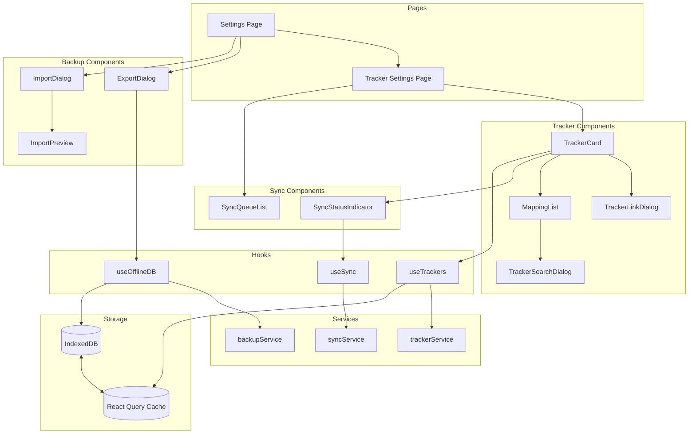

---

## 6. OAuth Flow Diagrams

### 6.1 Common OAuth Flow (PKCE)

All trackers use OAuth 2.0 with PKCE (Proof Key for Code Exchange) for security.

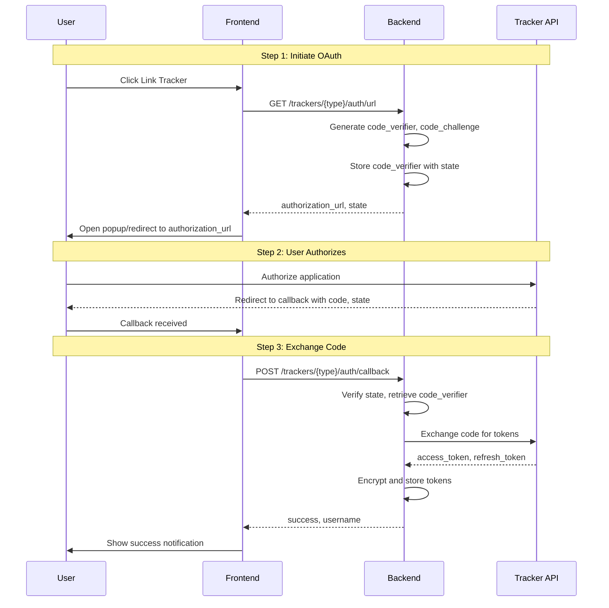

### 6.2 MyAnimeList OAuth Flow

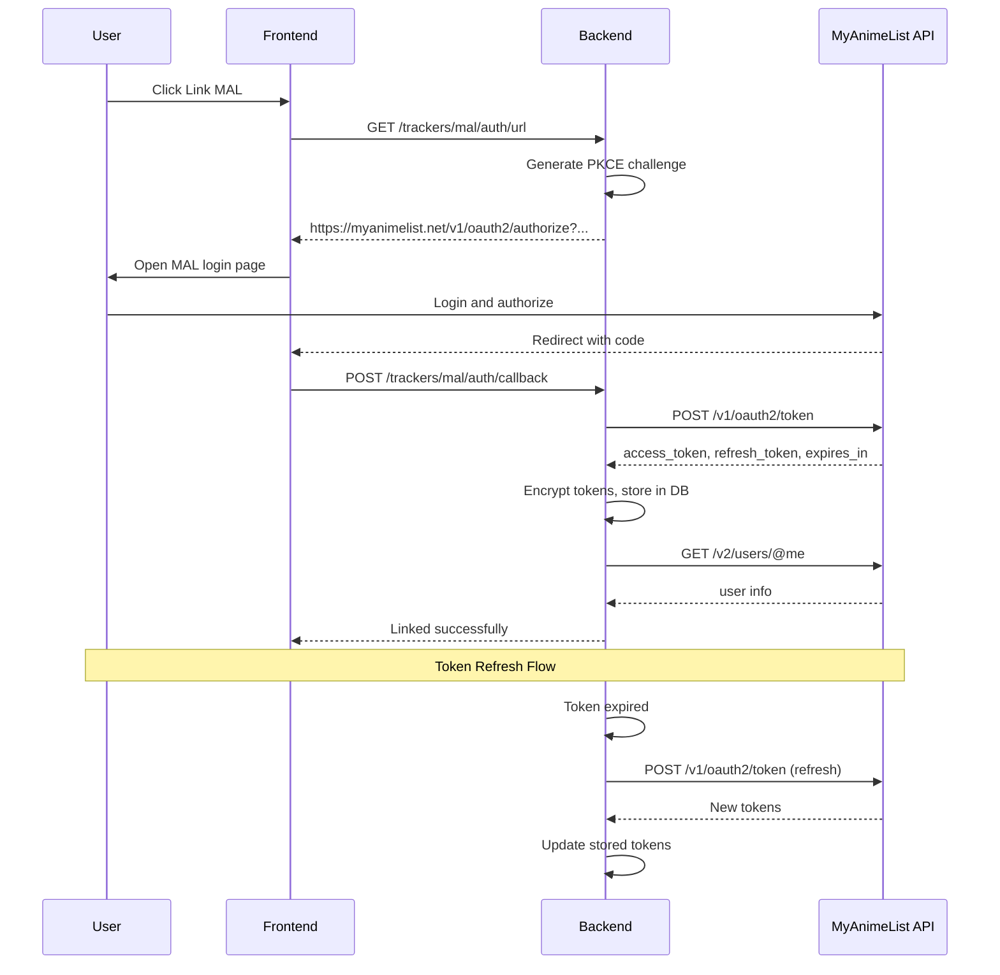

**MAL OAuth Configuration:**
- Authorization URL: `https://myanimelist.net/v1/oauth2/authorize`
- Token URL: `https://myanimelist.net/v1/oauth2/token`
- Scopes: `read`, `write`
- PKCE: Required

### 6.3 AniList OAuth Flow

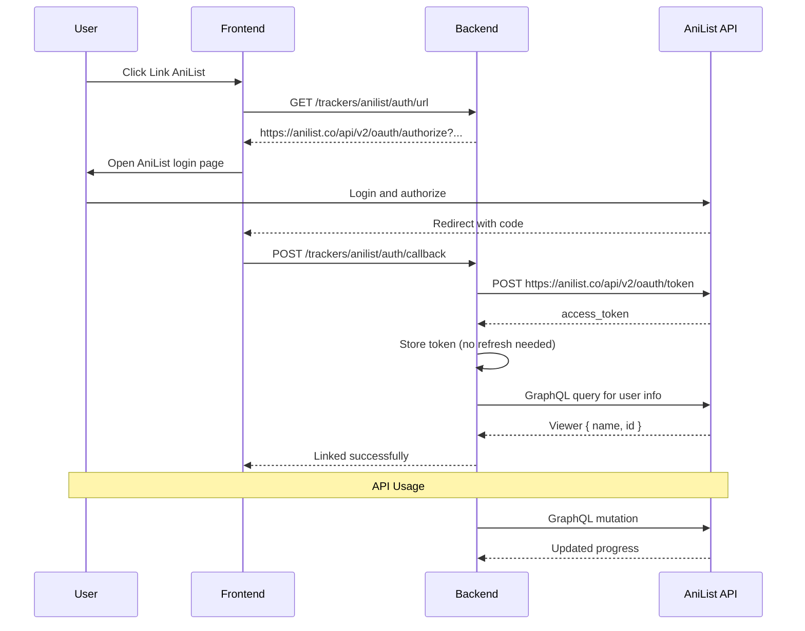

**AniList OAuth Configuration:**
- Authorization URL: `https://anilist.co/api/v2/oauth/authorize`
- Token URL: `https://anilist.co/api/v2/oauth/token`
- Scopes: None (implicit)
- PKCE: Optional but recommended

### 6.4 Kitsu OAuth Flow

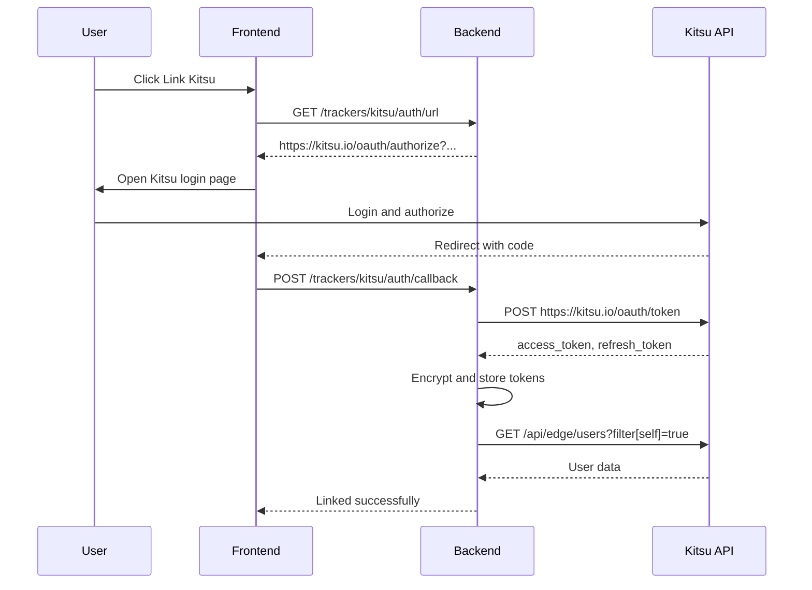

**Kitsu OAuth Configuration:**
- Authorization URL: `https://kitsu.io/oauth/authorize`
- Token URL: `https://kitsu.io/oauth/token`
- Scopes: `read`, `write`
- PKCE: Recommended

### 6.5 MangaUpdates OAuth Flow

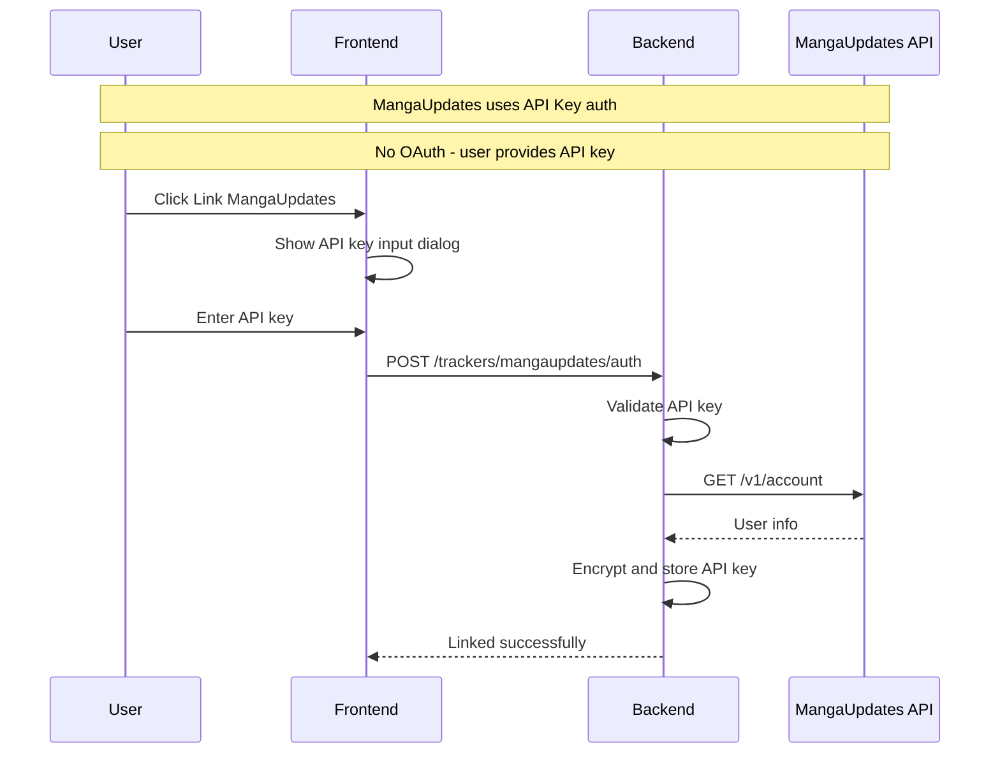

**MangaUpdates Configuration:**
- Auth Type: API Key (no OAuth)
- User must generate API key from MangaUpdates settings
- Key stored encrypted in database

---

## 7. Sync Strategy

### 7.1 Sync Triggers

| Event | Action | Priority |
|-------|--------|----------|
| Chapter completion | Queue progress update | High |
| Library add | Queue library add | Medium |
| Library remove | Queue library remove | Medium |
| Manual sync request | Full sync | User-initiated |
| App startup | Sync pending queue | Low |
| Periodic interval | Background sync | Low |

### 7.2 Sync Flow

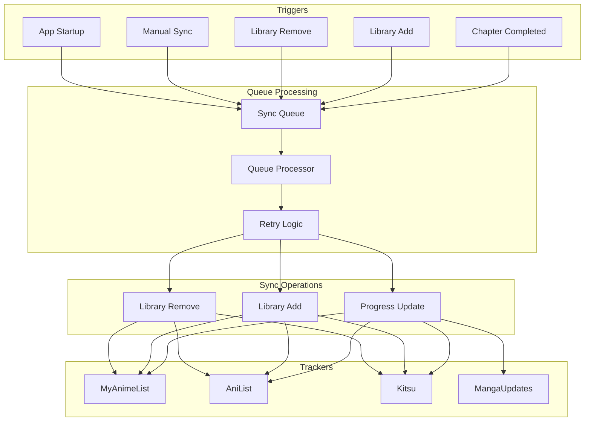

### 7.3 Conflict Resolution

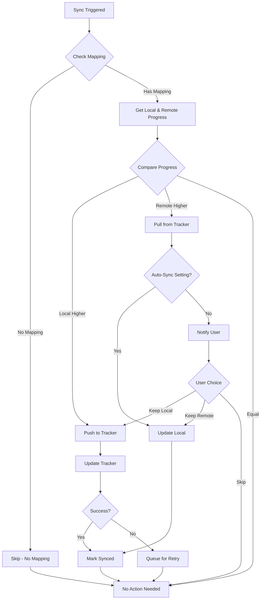

### 7.4 Conflict Resolution Strategies

| Strategy | Description | Use Case |
|----------|-------------|----------|
| `local_wins` | Always use local progress | User reads offline frequently |
| `remote_wins` | Always use tracker progress | User updates tracker directly |
| `higher_wins` | Use higher chapter count | Default strategy |
| `manual` | Prompt user for each conflict | User wants full control |

### 7.5 Error Handling

```python
# backend/app/services/sync_service.py

class SyncError(Exception):
    """Base sync error."""
    def __init__(self, message: str, retryable: bool = True, retry_after: int = 60):
        self.message = message
        self.retryable = retryable
        self.retry_after = retry_after
        super().__init__(message)

class AuthenticationError(SyncError):
    """Token expired or revoked."""
    def __init__(self, tracker_type: str):
        super().__init__(
            f"Authentication expired for {tracker_type}",
            retryable=False
        )

class RateLimitError(SyncError):
    """Rate limit exceeded."""
    def __init__(self, tracker_type: str, retry_after: int):
        super().__init__(
            f"Rate limit exceeded for {tracker_type}",
            retryable=True,
            retry_after=retry_after
        )

class NetworkError(SyncError):
    """Network connectivity issue."""
    def __init__(self, tracker_type: str):
        super().__init__(
            f"Network error connecting to {tracker_type}",
            retryable=True
        )

class MappingNotFoundError(SyncError):
    """No mapping exists for manga."""
    def __init__(self, manga_id: int, tracker_type: str):
        super().__init__(
            f"No mapping found for manga {manga_id} on {tracker_type}",
            retryable=False
        )
```

### 7.6 Retry Strategy

```python
# Retry configuration
RETRY_CONFIG = {
    'max_retries': 3,
    'base_delay': 60,  # seconds
    'max_delay': 3600,  # 1 hour
    'exponential_base': 2,
}

def calculate_retry_delay(retry_count: int) -> int:
    """Calculate delay with exponential backoff."""
    delay = RETRY_CONFIG['base_delay'] * (RETRY_CONFIG['exponential_base'] ** retry_count)
    return min(delay, RETRY_CONFIG['max_delay'])
```

---

## 8. Security Considerations

### 8.1 Token Storage

```python
# backend/app/services/encryption.py

from cryptography.fernet import Fernet
from cryptography.hazmat.primitives import hashes
from cryptography.hazmat.primitives.kdf.pbkdf2 import PBKDF2HMAC
import base64
import os

class TokenEncryption:
    """Handles encryption/decryption of OAuth tokens."""
    
    def __init__(self):
        # Key derived from environment variable or generated
        self._key = self._get_or_create_key()
        self._fernet = Fernet(self._key)
    
    def _get_or_create_key(self) -> bytes:
        """Get encryption key from environment or create new."""
        key_env = os.environ.get('PYYOMI_ENCRYPTION_KEY')
        if key_env:
            return base64.urlsafe_b64decode(key_env)
        
        # Generate new key (should be stored securely in production)
        key_file = os.path.join(os.environ.get('DATA_DIR', './data'), '.key')
        if os.path.exists(key_file):
            with open(key_file, 'rb') as f:
                return f.read()
        
        key = Fernet.generate_key()
        with open(key_file, 'wb') as f:
            f.write(key)
        os.chmod(key_file, 0o600)  # Owner read/write only
        return key
    
    def encrypt(self, token: str) -> str:
        """Encrypt a token."""
        return self._fernet.encrypt(token.encode()).decode()
    
    def decrypt(self, encrypted_token: str) -> str:
        """Decrypt a token."""
        return self._fernet.decrypt(encrypted_token.encode()).decode()
```

### 8.2 PKCE Implementation

```python
# backend/app/services/oauth/pkce.py

import secrets
import base64
import hashlib

def generate_pkce_verifier() -> str:
    """Generate a cryptographically random code verifier."""
    return base64.urlsafe_b64encode(secrets.token_bytes(32)).decode().rstrip('=')

def generate_pkce_challenge(verifier: str) -> str:
    """Generate code challenge from verifier using S256 method."""
    digest = hashlib.sha256(verifier.encode()).digest()
    return base64.urlsafe_b64encode(digest).decode().rstrip('=')

def generate_state() -> str:
    """Generate a random state token for CSRF protection."""
    return secrets.token_urlsafe(32)
```

### 8.3 Security Best Practices

1. **Token Storage**
   - Never store tokens in plain text
   - Use AES-256 encryption for all tokens
   - Store encryption key separately from database

2. **OAuth Flow**
   - Always use PKCE for public clients
   - Validate state parameter on callback
   - Use short-lived authorization codes
   - Implement token rotation

3. **API Security**
   - Validate all input parameters
   - Rate limit API endpoints
   - Log all authentication events
   - Implement CORS restrictions

4. **Data Export**
   - Exclude encrypted tokens from exports
   - Warn users about sensitive data in exports
   - Allow selective data export

---

## 9. File Structure

### 9.1 New Files to Create

```
backend/
├── app/
│   ├── api/
│   │   ├── trackers.py          # OAuth and tracker management endpoints
│   │   ├── sync.py              # Sync operation endpoints
│   │   └── backup.py            # Export/import endpoints
│   ├── db/
│   │   └── models.py            # Add new models (TrackerCredential, etc.)
│   └── services/
│       ├── encryption.py        # Token encryption service
│       ├── sync_service.py      # Sync orchestration service
│       └── trackers/
│           ├── __init__.py
│           ├── base.py          # Base tracker interface
│           ├── mal.py           # MyAnimeList implementation
│           ├── anilist.py       # AniList implementation
│           ├── kitsu.py         # Kitsu implementation
│           └── mangaupdates.py  # MangaUpdates implementation

frontend/
├── src/
│   ├── app/
│   │   └── settings/
│   │       └── trackers/
│   │           └── page.tsx     # Tracker settings page
│   ├── components/
│   │   ├── trackers/
│   │   │   ├── TrackerCard.tsx
│   │   │   ├── TrackerLinkDialog.tsx
│   │   │   ├── TrackerSearchDialog.tsx
│   │   │   └── MappingList.tsx
│   │   ├── backup/
│   │   │   ├── ExportDialog.tsx
│   │   │   ├── ImportDialog.tsx
│   │   │   └── ImportPreview.tsx
│   │   └── sync/
│   │       ├── SyncStatusIndicator.tsx
│   │       └── SyncQueueList.tsx
│   ├── hooks/
│   │   ├── useTrackers.ts
│   │   ├── useSync.ts
│   │   └── useOfflineDB.ts
│   ├── lib/
│   │   ├── db/
│   │   │   ├── schema.ts
│   │   │   ├── migrations.ts
│   │   │   └── sync.ts
│   │   └── api.ts               # Extend with new endpoints
│   ├── services/
│   │   ├── trackerService.ts
│   │   ├── syncService.ts
│   │   └── backupService.ts
│   └── types/
│       └── tracker.ts           # Tracker type definitions
```

### 9.2 Files to Modify

| File | Changes |
|------|---------|
| [`backend/app/main.py`](backend/app/main.py) | Add new routers for trackers, sync, backup |
| [`backend/app/db/models.py`](backend/app/db/models.py) | Add TrackerCredential, TrackerMapping, SyncQueue, DataExport models |
| [`backend/app/db/migrations.py`](backend/app/db/migrations.py) | Add migration for new tables |
| [`frontend/src/lib/api.ts`](frontend/src/lib/api.ts) | Add API functions for trackers, sync, backup |
| [`frontend/src/types.ts`](frontend/src/types.ts) | Add tracker-related types |
| [`frontend/src/components/Navigation.tsx`](frontend/src/components/Navigation.tsx) | Add Trackers menu item |
| [`frontend/src/app/settings/page.tsx`](frontend/src/app/settings/page.tsx) | Add backup/restore section |
| [`frontend/package.json`](frontend/package.json) | Add dexie dependency |

---

## 10. Implementation Phases

### Phase 1: Foundation
- [ ] Add new database models and migrations
- [ ] Implement token encryption service
- [ ] Create base tracker interface
- [ ] Set up IndexedDB with Dexie.js

### Phase 2: OAuth Integration
- [ ] Implement MyAnimeList OAuth
- [ ] Implement AniList OAuth
- [ ] Implement Kitsu OAuth
- [ ] Implement MangaUpdates API key auth
- [ ] Create tracker settings UI

### Phase 3: Sync Engine
- [ ] Implement sync queue processor
- [ ] Create progress update sync
- [ ] Implement conflict resolution
- [ ] Add sync status UI

### Phase 4: Data Portability
- [ ] Implement data export
- [ ] Implement data import with preview
- [ ] Add IndexedDB sync with backend
- [ ] Create backup/restore UI

### Phase 5: Polish & Testing
- [ ] Add comprehensive error handling
- [ ] Implement retry logic
- [ ] Add unit and integration tests
- [ ] Performance optimization

---

## Appendix A: Tracker API Reference

### MyAnimeList API

| Endpoint | Method | Description |
|----------|--------|-------------|
| `/v2/manga` | GET | Search manga |
| `/v2/manga/{id}` | GET | Get manga details |
| `/v2/manga/{id}/my_list_status` | PUT | Update reading status |
| `/v2/users/@me/mangalist` | GET | Get user's manga list |

### AniList API (GraphQL)

```graphql
# Search manga
query SearchManga($search: String) {
  Media(search: $search, type: MANGA) {
    id
    title { romaji english native }
    chapters
    status
  }
}

# Update progress
mutation UpdateProgress($mediaId: Int, $progress: Int) {
  SaveMediaListEntry(mediaId: $mediaId, progress: $progress) {
    id
    progress
  }
}
```

### Kitsu API

| Endpoint | Method | Description |
|----------|--------|-------------|
| `/api/edge/manga` | GET | Search manga |
| `/api/edge/library-entries` | POST | Add to library |
| `/api/edge/library-entries/{id}` | PATCH | Update progress |

### MangaUpdates API

| Endpoint | Method | Description |
|----------|--------|-------------|
| `/v1/series/search` | POST | Search manga |
| `/v1/series/{id}` | GET | Get series details |
| `/v1/lists/series` | GET | Get user's list |

---

## Appendix B: Export Data Format

```json
{
  "version": "1.0",
  "exported_at": "2026-02-24T00:00:00Z",
  "app_version": "1.0.0",
  "data": {
    "library": [
      {
        "id": 1,
        "manga": {
          "title": "Example Manga",
          "url": "https://example.com/manga/1",
          "source": "mangahere:en"
        },
        "added_at": "2026-01-01T00:00:00Z",
        "categories": [1, 2]
      }
    ],
    "history": [
      {
        "manga_id": 1,
        "chapter_number": 10,
        "read_at": "2026-02-01T00:00:00Z"
      }
    ],
    "categories": [
      { "id": 1, "name": "Reading" },
      { "id": 2, "name": "Completed" }
    ],
    "settings": {
      "reader.default_mode": "single",
      "reader.reading_direction": "ltr"
    },
    "tracker_mappings": [
      {
        "manga_id": 1,
        "tracker_type": "anilist",
        "tracker_manga_id": "12345"
      }
    ]
  },
  "checksum": "sha256:..."
}
```

---

*End of Document*
